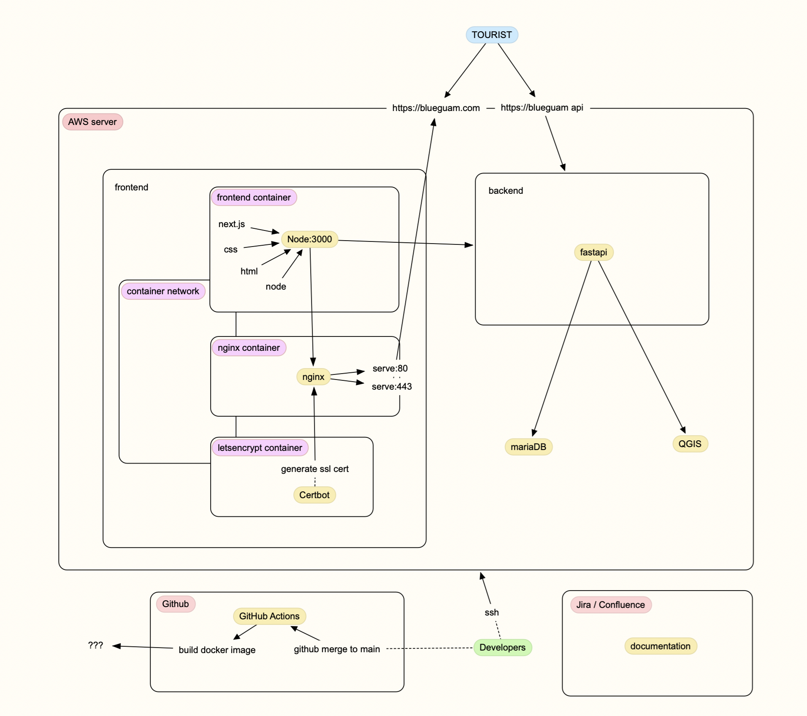

# Welcome to Blue Guam 🌴



Blue Guam is your ultimate tourist guide app that brings the beauty and adventures of Guam to your fingertips. Whether you're planning a trip or navigating the island, our app ensures you don't miss out on the experiences Guam has to offer.

Visit our website: [blueguam.com](https://blueguam.com)

## Usage

### Development

Make a `.env.development` file with an `NEXT_PUBLIC_API_BASE` variable ex:
`NEXT_PUBLIC_API_BASE=https://path/to/api`

for hot-reloading:  
`npm run dev`

to test docker build:
```
make build-development
make start-development
```

### Deployment

Make a `.env` file inside `/docker/production` with the following variables:
```
HOST=yoursite.com
LETSENCRYPT_EMAIL=your@email.com
```

For automatic deployments, add the `secrets` variables to the project/actions/secrets_an_variables mentioned in `.github/workflows/test_action.yml`.

Also add the public key to your server's `~/.ssh/authorized_keys` file. For safety, consider prefixing the ssh key with something like the following:
`command="/home/user/repo/update.sh >> ~/repo-build.log",restrict`
